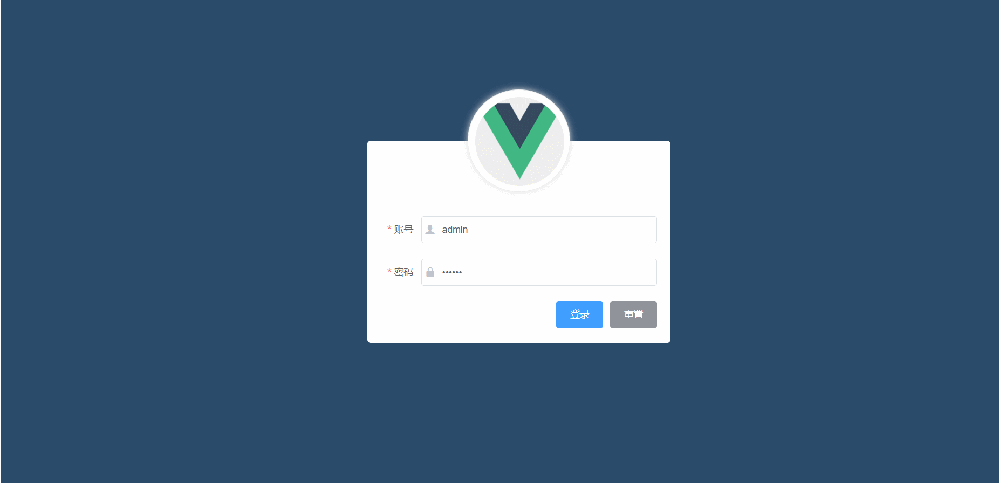

<!DOCTYPE html>
<html lang="en">
<head>
  <meta charset="UTF-8">
  <meta name="viewport" content="width=device-width, initial-scale=1.0">
</head>
<body style="width: 100%;">
  

    

      <h1>项目效果图</h1>
      <h1><a href="http://shop.chenxinlong.xyz/">线上查看</a></h1>
      
    

    

      <h1>项目使用须知</h1>
      <h1>项目主要使用Vue+Element框架</h1>
      <h1>此项目为PC端后台管理系统</h1>
      <h1>使用时请先 npm install 安装扩展包</h1>
      <h1>项目启动命令 npm run start</h1>
      <h1>项目打包命令 npm run build</h1>
      <h3>次项目有两个路口文件main.js(main-dev.js和main-prod.js)</h3>
      <h3>开发时使用main-dev.js  使用本地的框架</h3>
      <h3>打包时使用main-prod.js 将项目中框架等等不打包,使用外链cdn方式</h3>
    

  

</body>
</html>